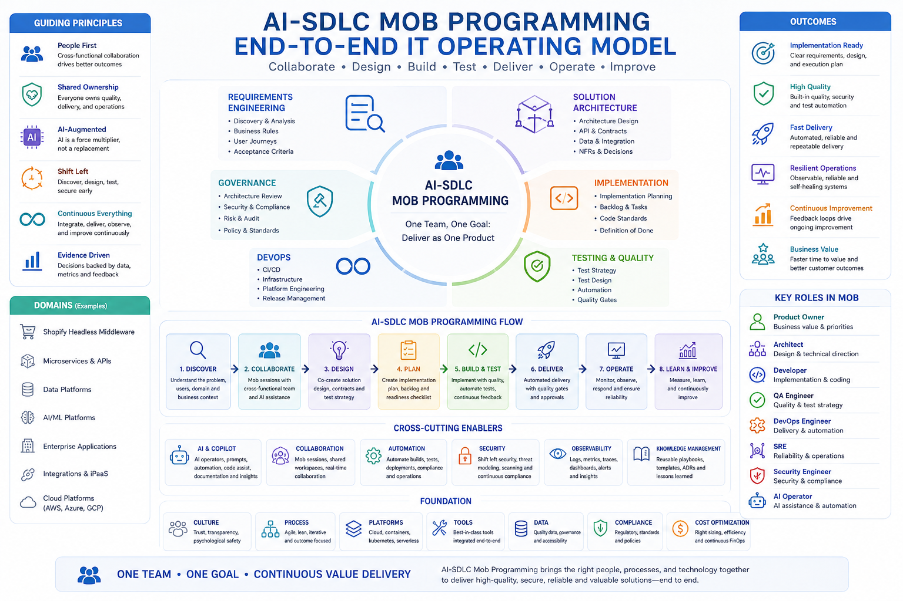

# AI-SDLC Mob Programming Testing

A repository dedicated to **AI-SDLC (AI-Assisted Software Development Lifecycle)** practices, **Mob Programming frameworks**, reusable **SKILL.md playbooks**, testing strategies, architecture patterns, and implementation readiness models.

The purpose of this repository is to help teams move from business requirements to implementation-ready outcomes through structured collaboration across Product, Architecture, Development, QA, DevOps, Security, and AI-assisted workflows.

---

## AI-SDLC Mob Programming Operating Model



*AI-SDLC Mob Programming Operating Model showing how Requirements Engineering, Solution Architecture, Governance, Implementation, Testing, DevOps, Security, Reliability, and Operations collaborate through AI-assisted mob sessions to produce implementation-ready outcomes.*

# Vision

Modern software delivery often involves multiple handoffs between teams.

```text
Requirements
  -> Architecture
  -> Development
  -> Testing
  -> Deployment
```

While effective, this approach can introduce:

* Information loss
* Delayed feedback
* Rework
* Architecture misunderstandings
* Testing gaps
* Security gaps
* Operational surprises

This repository explores a different approach:

```text
Shared Discovery
  -> Shared Design
  -> Shared Testing Strategy
  -> Shared Implementation Readiness
  -> Delivery
```

The objective is not to replace existing Agile, Scrum, Kanban, SAFe, or DevOps practices.

The objective is to provide reusable frameworks and playbooks that help teams create implementation-ready outcomes earlier in the lifecycle.

---

# What Is AI-SDLC Mob Programming?

AI-SDLC Mob Programming extends traditional Mob Programming beyond collaborative coding.

Instead of focusing only on implementation activities, teams collaborate across:

* Requirements Discovery
* Domain Analysis
* Architecture Design
* API Design
* Integration Design
* Testing Strategy
* Security Review
* Operational Readiness
* Implementation Planning

The goal is to create reusable engineering artifacts rather than meeting notes.

Typical outputs include:

* Business Rules
* Architecture Decisions
* API Contracts
* Event Contracts
* Test Scenarios
* Edge Cases
* Risk Assessments
* Security Considerations
* Observability Requirements
* Implementation Checklists
* Backlog-Ready Work Items

---

# Why This Repository Exists

Most organizations have established processes for:

* Backlog Refinement
* Sprint Planning
* Architecture Reviews
* Testing
* Security Reviews
* Operational Readiness Reviews

However, these activities are often performed independently.

This repository provides a structured way to bring those perspectives together through reusable playbooks, frameworks, templates, and domain examples.

The focus is not on generating more documentation.

The focus is on creating shared understanding and implementation readiness.

---

# Repository Structure

```text
AI-SDLC-Mob-Programming-Testing/
├── skills/
├── requirements-engineering/
├── solution-architecture/
├── mob-programming/
├── implementation/
├── testing/
├── devops/
├── governance/
├── domains/
│   └── shopify-headless/
└── prompts/
```

---

# Framework Areas

## Requirements Engineering

Focuses on:

* Discovery workshops
* Business rule analysis
* Domain modeling
* Requirements clarification
* Stakeholder alignment

---

## Solution Architecture

Focuses on:

* Architecture patterns
* Integration strategies
* API design
* Event-driven architectures
* System decomposition

---

## Mob Programming

Contains the AI-SDLC Mob Programming framework.

Key topics include:

* Session facilitation
* Roles and responsibilities
* Implementation readiness
* AI participation models
* Collaborative engineering workflows

Start here:

```text
mob-programming/README.md
```

---

## Implementation

Focuses on:

* Delivery planning
* Implementation checklists
* Dependency management
* Execution readiness

---

## Testing

Focuses on:

* Test strategy
* Test design
* Edge case identification
* Failure-mode analysis
* Quality engineering practices

---

## DevOps

Focuses on:

* Deployment readiness
* Observability
* Reliability
* Operational excellence
* Monitoring and alerting

---

## Governance

Focuses on:

* Architecture reviews
* Security reviews
* Decision records
* Compliance considerations
* Delivery governance

---

# SKILL.md Playbooks

The repository uses **SKILL.md** files as reusable domain playbooks.

A SKILL.md file helps guide collaborative engineering sessions by defining:

* Objectives
* Required tools
* Required access
* Required scopes
* Participant roles
* Architecture considerations
* Testing considerations
* Expected outcomes
* Deliverables

These playbooks can be adapted across multiple domains and technologies.

---

# Current Domain Example

## Shopify Headless Middleware

The first domain implementation focuses on Shopify Headless Middleware.

Current playbooks include:

```text
skills/
└── shopify-headless-middleware/
    ├── SKILL.md
    └── references/
        ├── discount-segmentation.md
        ├── checkout-customization.md
        ├── inventory-sync.md
        └── oms-erp-integration.md
```

Topics include:

* Discount Segmentation
* Checkout Customization
* Inventory Synchronization
* OMS / ERP Integration

These examples demonstrate how the AI-SDLC Mob Programming framework can be applied to real-world commerce and middleware scenarios.

---

# How to Use This Repository

Recommended learning path:

## Step 1

Review:

```text
mob-programming/README.md
```

to understand the Mob Programming model.

## Step 2

Review:

```text
mob-programming/framework/
```

to understand:

* AI-SDLC Mob Programming
* Roles and Responsibilities
* Session Facilitation
* Implementation Readiness
* AI Participation

## Step 3

Review:

```text
skills/shopify-headless-middleware/
```

to see a complete domain example.

## Step 4

Apply the framework to your own:

* APIs
* Integrations
* Microservices
* Data Platforms
* Cloud Architectures
* Enterprise Applications

---

# Expected Outcomes

Teams using these frameworks should be able to produce:

* Better requirements clarity
* Stronger architecture discussions
* Earlier test design
* Improved risk identification
* Better implementation planning
* Improved cross-functional alignment
* Implementation-ready engineering artifacts

---

# Long-Term Direction

Shopify Headless Middleware is the first implementation domain.

Future domains may include:

* Microservices
* Enterprise Integrations
* AI Agents
* Data Platforms
* Cloud-Native Architectures
* Salesforce
* Platform Engineering
* Quality Engineering
* DevOps Transformation

The framework remains the same.

Only the domain playbooks change.

---

# Guiding Principle

Traditional delivery often asks:

```text
What work should we do?
```

AI-SDLC Mob Programming asks:

```text
What do we need to collectively understand,
design, test, secure, operate,
and implement before delivery begins?
```

That question is the foundation of this repository.
